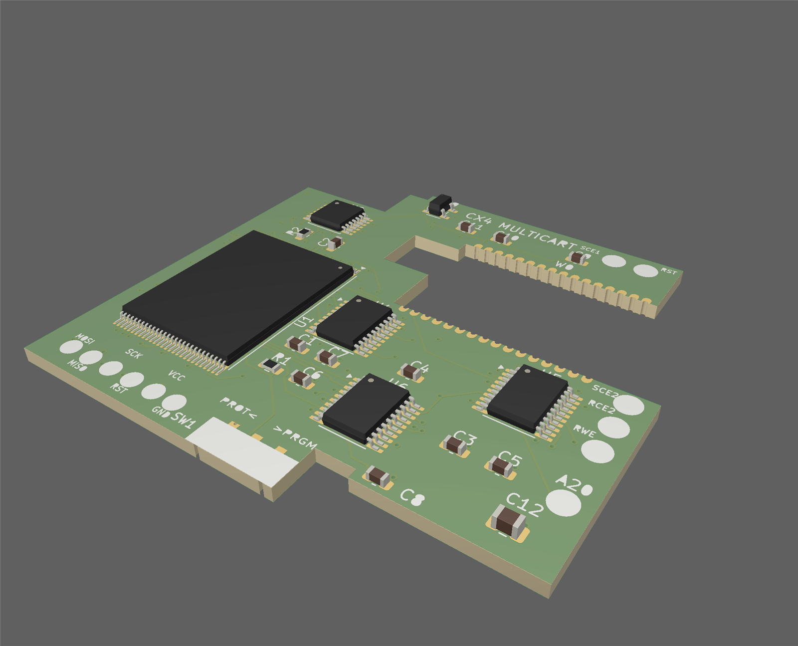
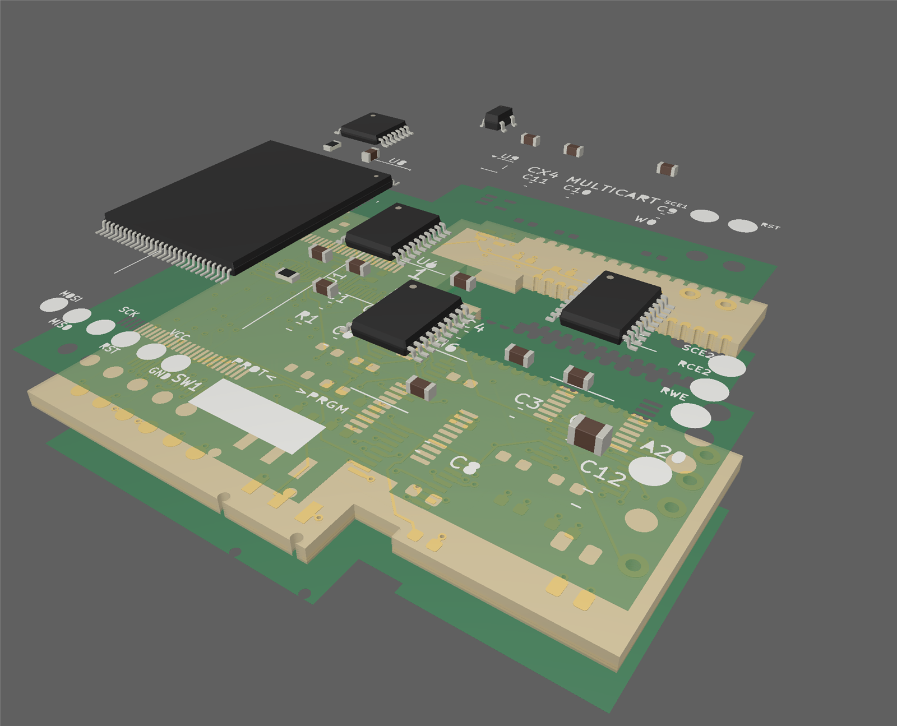
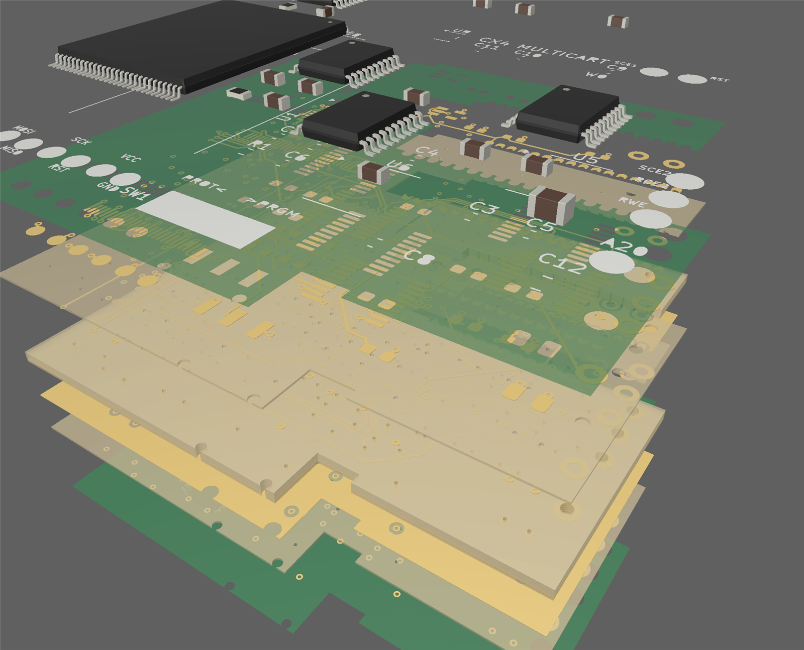
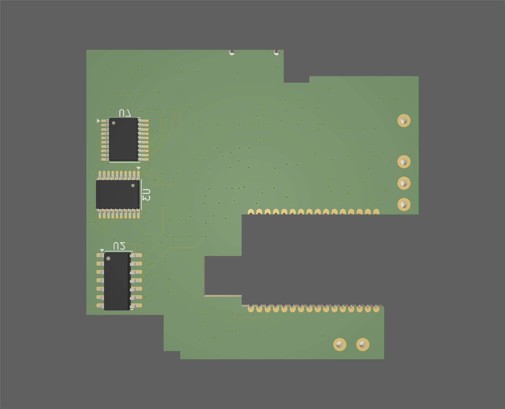
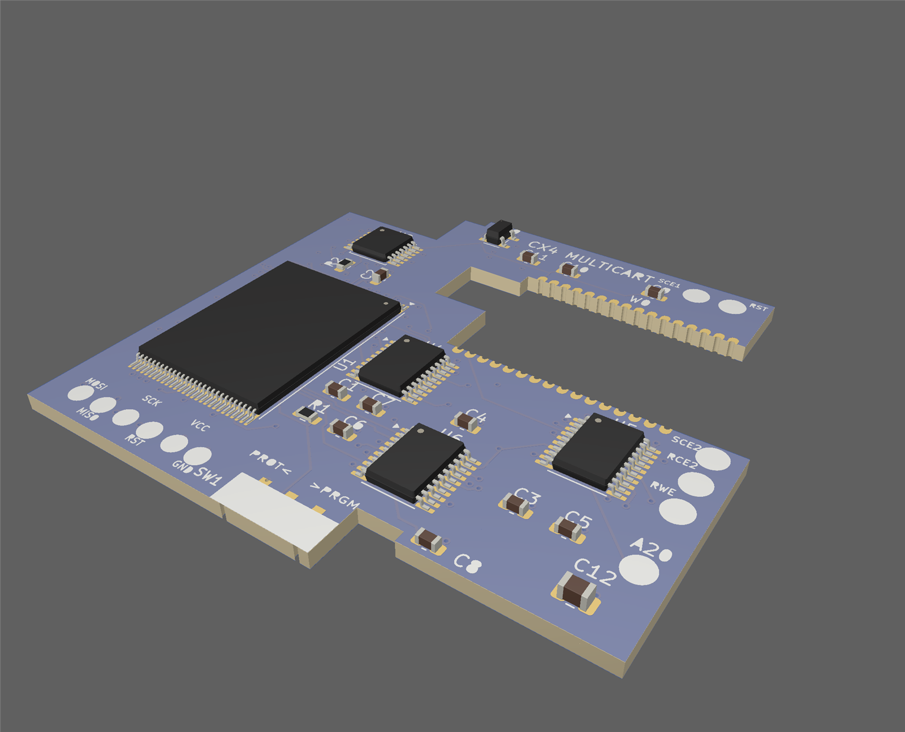
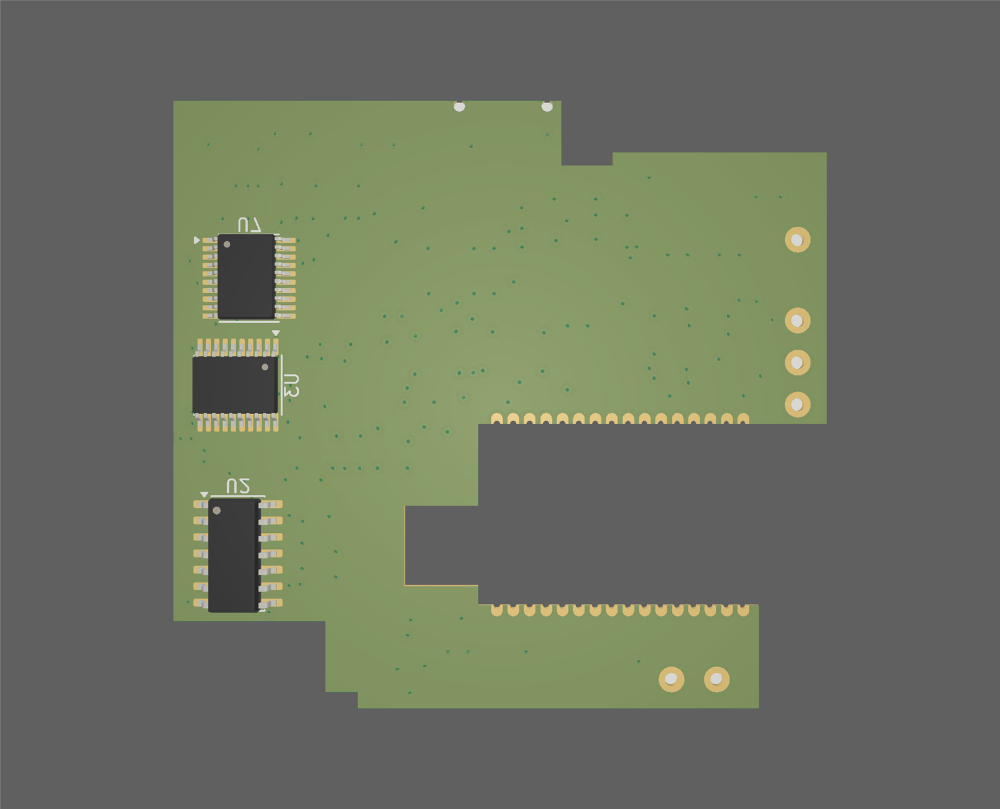

# pcbview

**A standalone, GPU-accelerated 3D viewer for KiCad projects and Gerber packages.**

pcbview renders a printed circuit board the way the *fab* will build it — not the
way any one CAD tool happens to draw it. Point it at a `.kicad_pcb` or a folder /
zip / `.gbrjob` of Gerbers and it reconstructs the physical stackup — copper,
soldermask (with via tenting), silkscreen, drills, the dielectric core — as real
3D geometry you can orbit, slice, and explode. KiCad projects additionally get
**3D component bodies**, sourced automatically from your installed KiCad model
library.

It is written from scratch in C++20 on **Vulkan** and **Qt 6**, with no CAD
engine underneath — native parsers feed a single geometry pipeline. The renderer
was built RT-ready from day one for a future hardware ray-tracing mode.



---

## Features

- **Two front-ends, one pipeline.** A native KiCad `.kicad_pcb` importer and a
  native Gerber (RS-274X) + Excellon importer both resolve to the same
  filled-polygon layer model, so every downstream feature works for both. The
  two paths are cross-validated to under 1% on the same board.
- **Physically-built rendering.** Copper clipped to the board outline (castellated
  edges and all), soldermask derived from its openings so **via tenting is free**,
  silkscreen graphics *and* stroked text, drills subtracted, and a dielectric core
  extruded to the real finished thickness.
- **3D components (KiCad).** Component bodies are exported once from your installed
  `kicad-cli` and cached, so later opens need neither KiCad nor a network. Top- and
  bottom-mounted parts are placed correctly.
- **Exploded view.** `Ctrl` + scroll peels the stack outside-in, one ring at a
  time, dwelling between stages. The **dielectric is sliced between copper layers**,
  so inner trace layers separate into their true positions instead of sliding
  through one block. Components lift off onto their own plane.
- **Adjustable appearance.** Override the finished thickness (preview a flex build
  at 0.1–0.8 mm), make the substrate translucent, and recolor the substrate and the
  soldermask live.
- **Layer control.** Per-layer visibility, a one-click components toggle, and
  auto-hiding side panels (pin, or peek-on-hover).
- **Print & export.** Print as-shown, flat (overhead orthographic), or **flat at
  true 1:1 physical size**, with a print preview. Save a PNG/JPG screenshot.
- **Smooth navigation.** Orbit / pan / zoom, animated view presets (top / bottom /
  iso / fit), orthographic toggle, drag-and-drop, and recent-file history.

## Screenshots

| Exploded — components + layers | Full multilayer peel |
|---|---|
|  |  |

| Bottom side (bottom-mounted parts) | Live appearance (blue mask) |
|---|---|
|  |  |

The exploded view slices the dielectric between copper planes so every inner
trace layer is shown where it actually lives in the stack:



## Controls

| Action | Control |
|---|---|
| Orbit / pan / zoom | Left-drag / right-drag / scroll |
| Exploded view | `Ctrl` + scroll |
| Top / Bottom / Isometric | `T` / `B` / `I` |
| Fit to board | `F` |
| Orthographic toggle | `O` |
| Open board / gerbers | `Ctrl`+`O` |
| Reload | `F5` |
| Save screenshot | `Ctrl`+`S` |
| Print (as shown) | `Ctrl`+`P` |
| Hide both side panels | `\` |

Layer visibility, appearance (thickness / substrate / mask), and the print modes
live in the menus. Each side panel has a **pin** and a **hide** button — hide tucks
it to a spine on the edge that pops open on hover; pin keeps it open.

## Building from source

pcbview is currently a **Windows / MSVC** build. You need:

1. **Vulkan SDK 1.4+** — <https://vulkan.lunarg.com/> (sets the `VULKAN_SDK`
   environment variable; provides `glslc`, used at build time to compile shaders).
2. **Qt 6.5+ (MSVC 64-bit kit)** — installed via the Qt online installer. Point the
   build at it with `-DQT_ROOT=C:/Qt/6.11.1/msvc2022_64` (or set `QT_ROOT`). The kit
   **must** be built with the same compiler as this project — a MinGW Qt kit will
   not link against MSVC.
3. **Visual Studio 2022+** with the C++ workload — it bundles CMake and Ninja, so no
   separate CMake install is required. (Any CMake ≥ 3.24 works if you have one.)

Everything else — Clipper2, earcut, glm, miniz, cgltf — is fetched automatically by
CMake; there is nothing else to install.

```sh
# from the repo root
cmake -B build -DQT_ROOT=C:/Qt/6.11.1/msvc2022_64
cmake --build build --config Release --target pcbview

# stage the Qt DLLs beside the exe for a portable, double-clickable folder
cmake --build build --config Release --target deploy
```

The result is `build/Release/pcbview.exe`. Run it with no arguments for the empty
viewer, or `pcbview.exe path/to/board.kicad_pcb`. The **`deploy`** target runs
`windeployqt` so the `build/Release` folder is xcopy-portable.

> **3D components** are optional and require KiCad to be installed (pcbview shells
> out to `kicad-cli` once per board and caches the result). Everything else works
> without KiCad. Set `PCBVIEW_KICAD_CLI` to point at a specific `kicad-cli.exe`, or
> `PCBVIEW_NO_COMPONENTS` to skip components entirely.

## How it works

The pipeline is `KiCad → BoardModel → LayerArt → BoardMesh → renderer` and
`Gerber → LayerArt → BoardMesh → renderer`. **LayerArt** — filled polygons per
layer — is the meeting point: only the importers know what a "track" is; everything
downstream is format-agnostic. Booleans are done in integer coordinates with
Clipper2, triangulated with earcut, and drawn through a reversed-Z Vulkan
rasterizer with a bindless per-instance material table.

The full design record — every measured fact, coordinate convention, and bug
post-mortem — lives in [ARCHITECTURE.md](ARCHITECTURE.md).

## Licensing

pcbview is licensed under the **GNU General Public License v3.0** — see
[LICENSE](LICENSE). It embeds KiCad's **Newstroke** stroke font (GPL-2.0-or-later)
for silkscreen text, and links Qt 6 (LGPL-3.0, dynamically) and the Vulkan loader
(Apache-2.0). GPL **v3** specifically is required because LGPL-3.0 and Apache-2.0
are incompatible with GPL-2.0. Full third-party attributions are in
[NOTICE.md](NOTICE.md), with license texts under [LICENSES/](LICENSES/).

## Roadmap

- **Done:** KiCad + Gerber import, tessellation, soldermask & silkscreen, the Qt
  "pro-CAD" GUI, exploded view, board appearance, 3D components, print/export.
- **Next:** hardware ray-traced lighting — the renderer already carries the
  extension, buffer, and material conventions for it.

## Author & support

Built by **David Janice** — [github.com/djanice1980](https://github.com/djanice1980).

For questions, bug reports, or feature requests, please
[open an issue](https://github.com/djanice1980/pcbview/issues) on this repository.

*Developed with the assistance of [Claude Code](https://claude.com/claude-code).*
