# pcbview

**A standalone, GPU-accelerated 3D viewer for KiCad projects and Gerber packages.**

[](https://github.com/djanice1980/pcbview/releases/latest)
[](LICENSE)
[](https://ko-fi.com/P5P81EV1M0)

pcbview renders a printed circuit board the way the *fab* will build it — not the
way any one CAD tool happens to draw it. Point it at a `.kicad_pcb` or a folder /
zip / `.gbrjob` of Gerbers and it reconstructs the physical stackup — copper,
soldermask (with via tenting), silkscreen, drills, the dielectric core — as real
3D geometry you can orbit, slice, and explode. KiCad projects additionally get
**3D component bodies**, sourced automatically from your installed KiCad model
library.

It is written from scratch in C++20 on **Vulkan** and **Qt 6**, with no CAD
engine underneath — native parsers feed a single geometry pipeline. The renderer
was built RT-ready from day one for a future hardware ray-tracing mode.

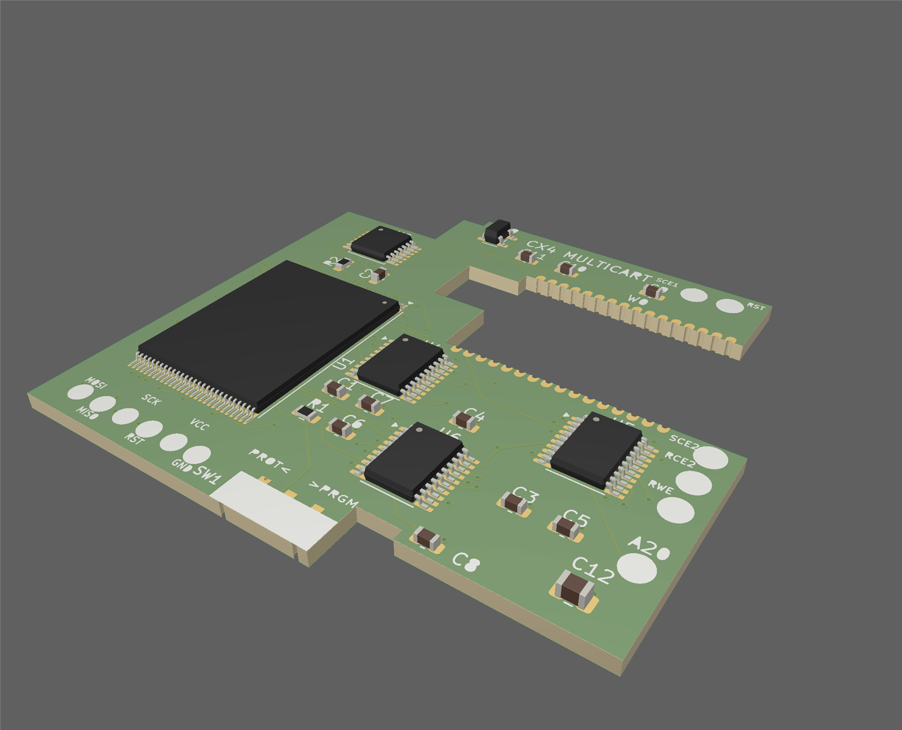

---

## Features

- **Two front-ends, one pipeline.** A native KiCad `.kicad_pcb` importer and a
  native Gerber (RS-274X) + Excellon importer both resolve to the same
  filled-polygon layer model, so every downstream feature works for both. The
  two paths are cross-validated to under 1% on the same board.
- **Physically-built rendering.** Copper clipped to the board outline (castellated
  edges and all), soldermask derived from its openings so **via tenting is free**,
  silkscreen graphics *and* stroked text, drills subtracted, and a dielectric core
  extruded to the real finished thickness.
- **3D components (KiCad).** Component bodies are exported once from your installed
  `kicad-cli` and cached, so later opens need neither KiCad nor a network. Top- and
  bottom-mounted parts are placed correctly.
- **VR.** Renders to an OpenXR headset — stereo at the runtime's own per-eye
  resolution, a submitted depth layer so dropped frames reproject by geometry,
  the hidden-area mask, fixed foveation, and a quality ladder that holds 90 Hz
  against a measured cost model. The board is placed at three times life size at
  arm's length, and the Sense controllers pick it up. See [VR](#vr).
- **Exploded view.** `Ctrl` + scroll peels the stack outside-in, one ring at a
  time, dwelling between stages. The **dielectric is sliced between copper layers**,
  so inner trace layers separate into their true positions instead of sliding
  through one block. Components lift off onto their own plane — and so do the
  **via barrels**, which stay intact as single plated tubes instead of being
  sliced with the layers.
- **Via barrels.** Every plated hole is lined with a copper barrel. Excellon
  plating is read **per tool**, so merged (MixedPlating) drill programs split
  plated from non-plated correctly; mounting holes stay bare. Slots cut both
  ways fabs emit them: **G85 obrounds and full rout mode** (G00/G01 milled
  paths, including G02/G03 arcs).
- **Blind & buried vias (KiCad).** A via spanning only part of the stack is
  bored only through its own layers — partial-depth hole, span-length barrel,
  outer faces intact — and in the exploded view it travels with the layers it
  connects instead of hanging in space.
- **Adjustable appearance.** Override the finished thickness (preview a flex build
  at 0.1–0.8 mm), make the substrate translucent, and recolor the substrate and the
  soldermask — including the **mask opacity**, which drives how strongly traces
  read through the film in both render modes.
- **Net highlighting (KiCad *and* Gerber).** Pick a net from the searchable **Nets** panel
  or just click a pad or via on the board: that signal **glows red** across
  every layer while the rest of the board mutes to grey, so a run can be
  followed through the stack and into the exploded view. **Ctrl+click (or
  Ctrl+click in the list) adds more nets, each in its own colour**, and the
  list rows are tinted to match so the panel doubles as the legend. In
  path-traced mode the nets are genuine emitters — they light the copper
  around them in their own colours and appear in reflections. Highlighted nets
  **animate**: a head sweeps the length of the run, then a band cycles along
  it, in every render mode including path tracing. The status bar reports
  routed length and via count.
- **Layer control.** Per-layer visibility, a one-click components toggle, and
  auto-hiding side panels (pin, or peek-on-hover). KiCad boards additionally
  get **per-component visibility**: a searchable Components panel with a
  checkbox per reference designator, and All/None acting on whatever the
  filter currently matches — filter to `C`, hit None, and just the capacitors
  vanish. (`PCBVIEW_HIDE` accepts refdes too, so captures can do the same
  headlessly.)
- **Print & export.** Print as-shown, flat (overhead orthographic), or **flat at
  true 1:1 physical size**, with a print preview. Save a PNG/JPG screenshot at
  **up to 4× the window** — a 4K/8K render for documentation or print, not a
  window grab. The board is re-rendered at the export size (a path-traced
  export re-converges first), and measurements and dimension callouts scale
  with it.
- **Measurement tools.** Hit the **ruler** button in the toolbar (or press `M`)
  and click two points: the distance readout
  **snaps to pad centres, drill/via centres and board-edge vertices**, so
  hole-to-hole and pad-to-pad measurements are fab-exact rather than
  click-precision. A rubber-band line with a live mm label follows the cursor;
  `Esc` clears; orbit/pan/zoom stay live while measuring. When both endpoints
  land on the **same net** (KiCad boards), a corner panel shows the **routed
  path between those two points** -- the copper the signal actually travels,
  walked along the net's tracks -- plus the net's total length and via count,
  next to the crow-flies distance.
  The **speed-square** button (View → Board dimensions) adds fab-drawing
  width/height callouts around the board.
- **Ray-traced lighting.** On a GPU with `ray_query` (most modern discrete cards
  and many iGPUs), an optional mode traces contact shadows and ambient occlusion
  from the fragment shader, so components read as *seated* on the board. Pick which
  GPU renders (Render → Graphics device) — pcbview defaults to a discrete, RT-ready
  card.
- **Path tracing + neural denoise.** A full progressive path tracer (global
  illumination, soft area-light shadows, colour bleeding, a translucent
  soldermask the traces read through) that converges while the view is still —
  **including the exploded view** — cleaned by **Intel Open Image Denoise**
  running GPU-accelerated (CUDA/HIP) on a background thread: the image snaps
  clean within a couple of frames of the camera stopping and keeps refining,
  with no UI stalls. Colours match the raster view (hue-preserving tonemap),
  and layer/component visibility toggles apply in both modes. The sun has a
  real angular size (adjustable via **Effects → Shadow softness**) and the
  translucent laminate transmits light diffusely, so shadows soften with
  distance and read correctly through a flex substrate.
- **CPU rendering — no GPU required.** Pick **CPU Rendering (llvm)** under
  Render → Graphics device and pcbview runs entirely on the CPU: rasterization
  through the bundled Mesa **lavapipe** driver, and both traced modes (RT
  shadows/AO *and* full path tracing) through **Intel Embree**, matching the
  GPU output. Everything ships in the box — no drivers to install.
- **Effects sliders.** Component reflections, pad shine, and path-tracing
  shadow softness are live sliders in the Effects menu, each with a numeric
  readout. Settings persist across runs in `~/.pcbview/settings.xml`.
- **Smooth navigation.** Orbit / pan / glide-zoom, animated view presets (top /
  bottom / iso / fit), orthographic toggle, drag-and-drop, and recent-file
  history.

## Screenshots

| Exploded — components + layers | Full multilayer peel |
|---|---|
| 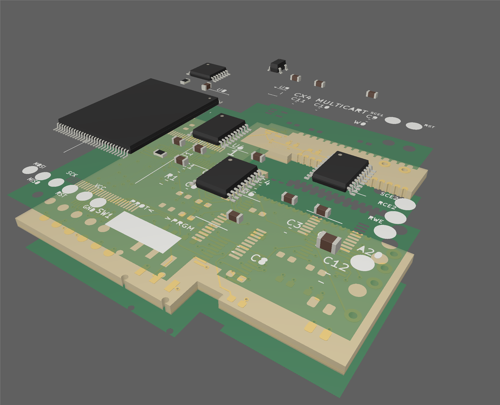 | 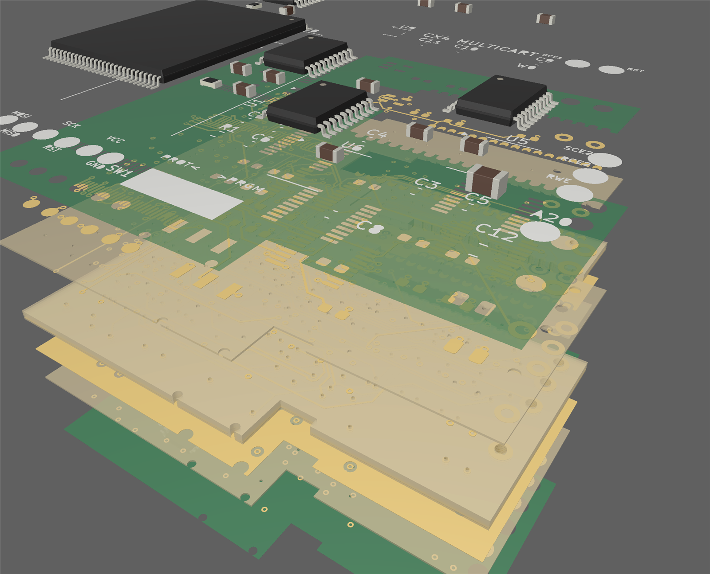 |

| Bottom side (bottom-mounted parts) | Live appearance (blue mask) |
|---|---|
| 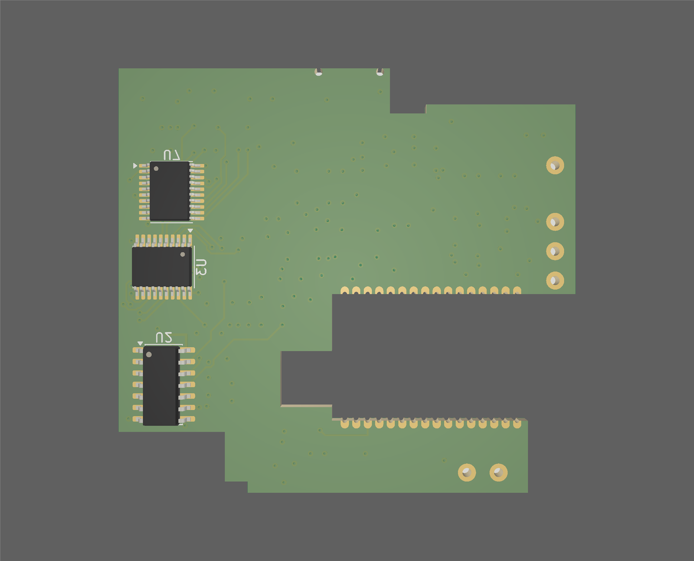 | 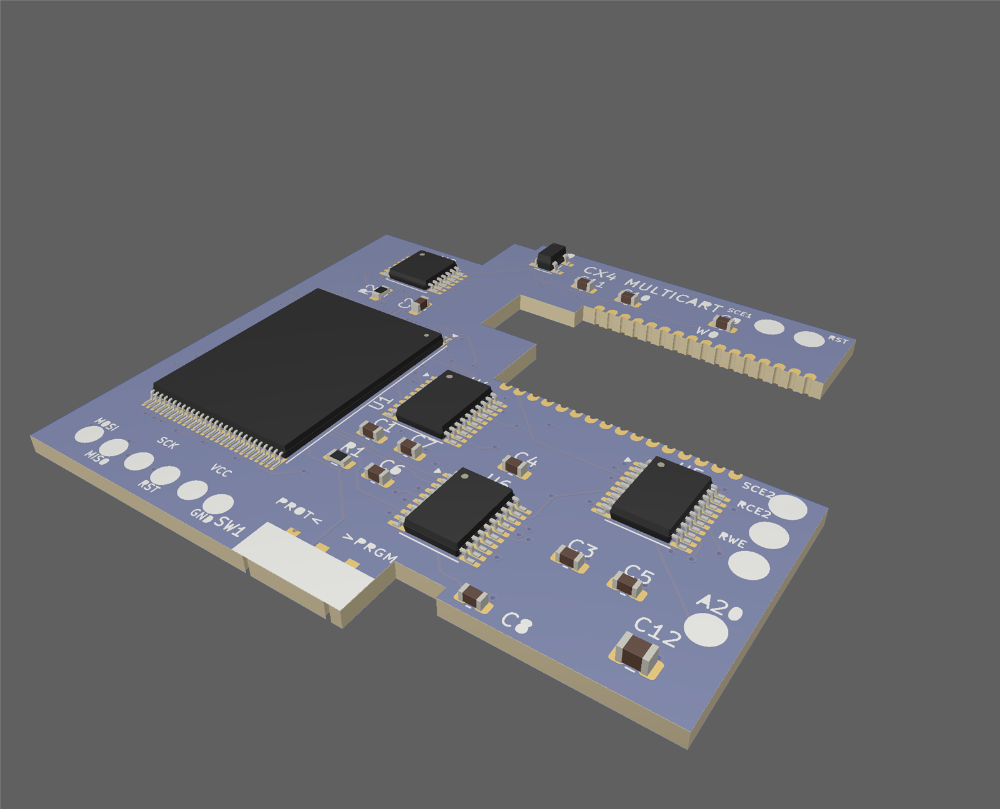 |

The exploded view slices the dielectric between copper planes so every inner
trace layer is shown where it actually lives in the stack:

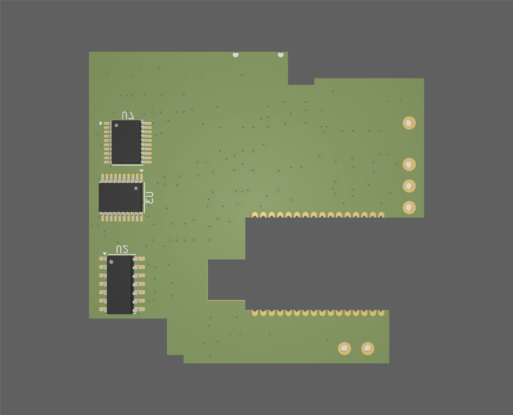

With ray tracing on, components gain traced contact shadows and ambient occlusion:

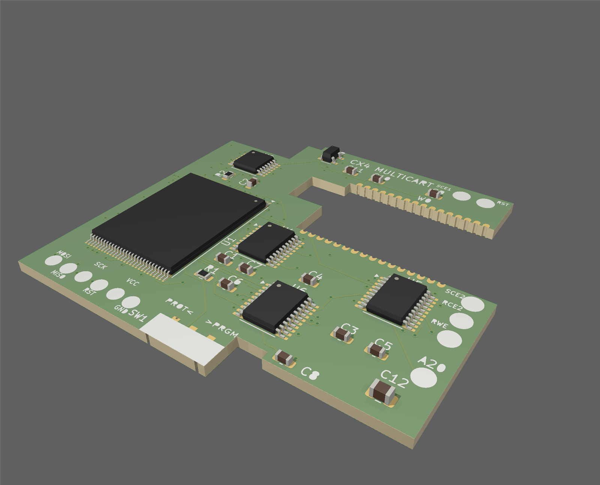

Full path tracing with the neural denoiser — global illumination and colour bleed,
clean:

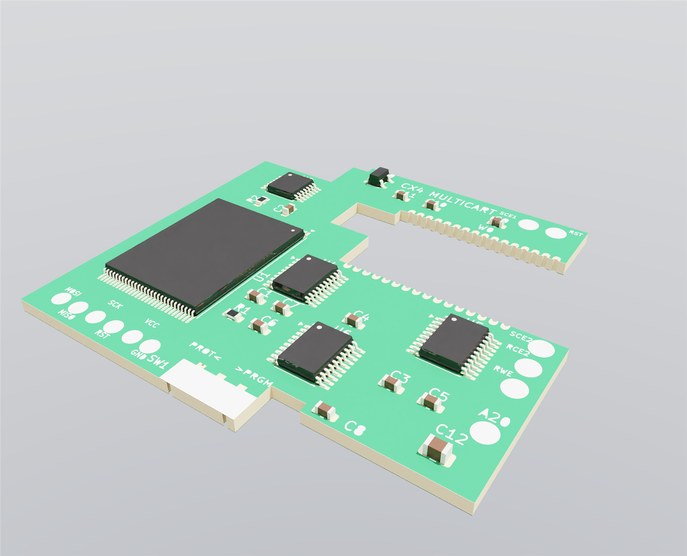

Path tracing works on populated boards — 3D component bodies with traced
shadows and GI:

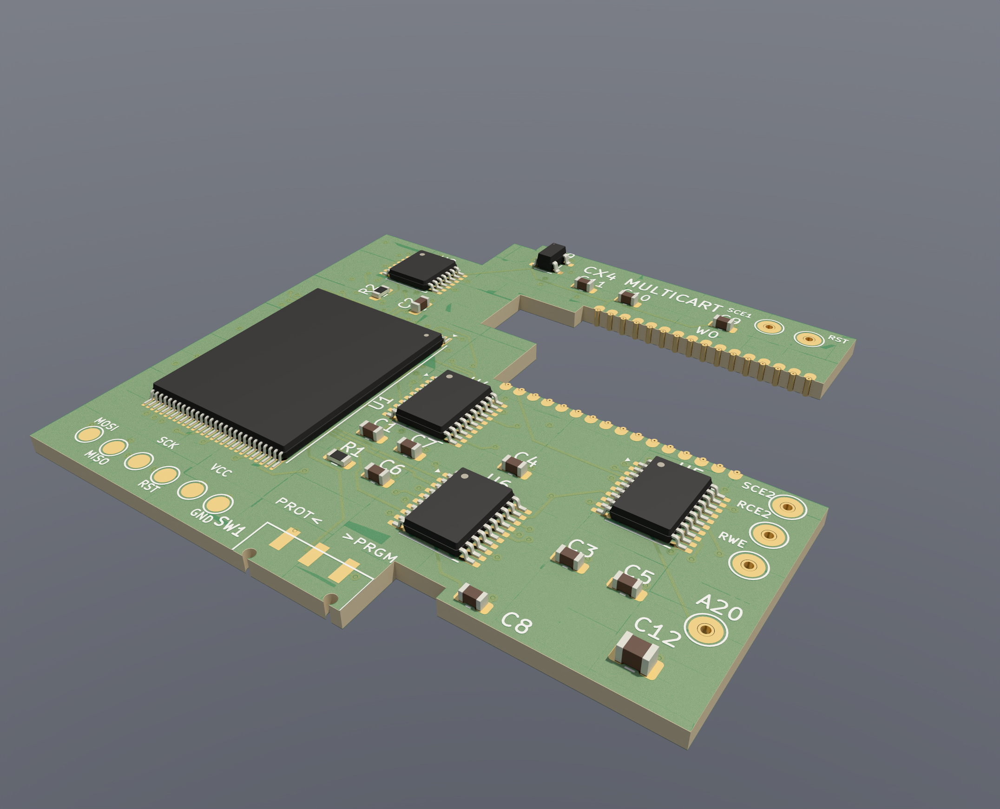

…and in the exploded view, where the fading dielectric reveals the inner copper
between the slabs:


Measure between any two points — snapped to pad and via centres, so the number
is the design dimension — with board width/height callouts and, when both ends
sit on one net, that net's **shortest routed path**. Here the two RST5 vias are
30.195 mm apart in a straight line but 38.260 mm along the copper:

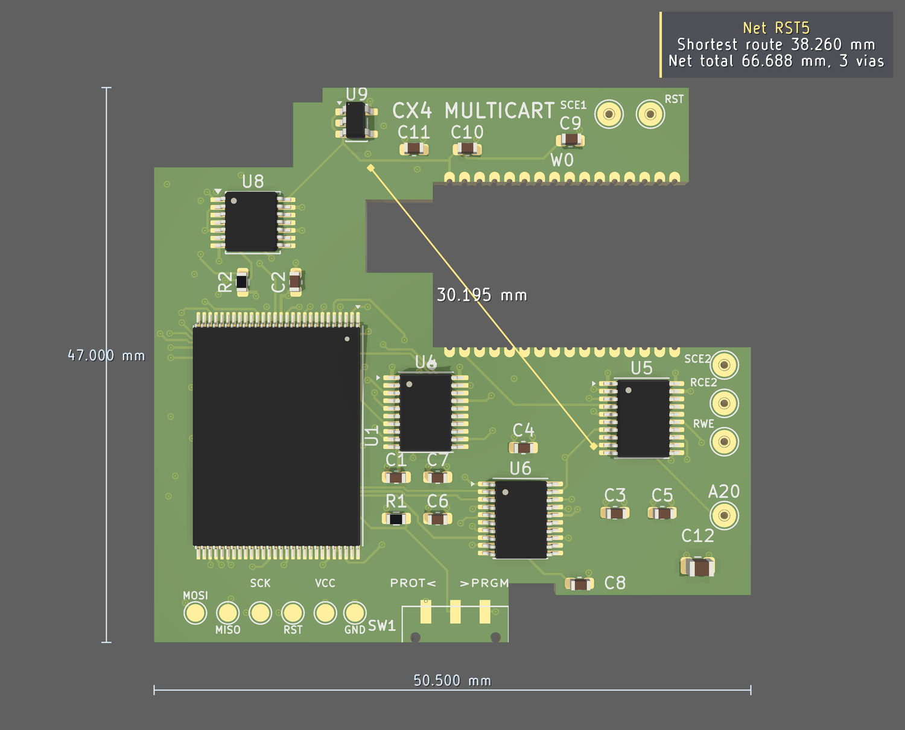

## Net highlighting

Click a net in the **Nets** panel to light it up; `Ctrl`-click to add more, each
in its own colour. This works for **Gerber packages too, not just KiCad boards**:
Gerbers carry no schematic, but Gerber X2 tags each object with its net via the
`%TO.N%` attribute (KiCad emits these by default), and pcbview reads them — so a
fab package alone is enough to trace a signal and get its routed length. The rest of the board desaturates and drops back so the
signals you care about are the only thing your eye lands on.

The highlight is **emissive, not painted on**. In raster and ray-traced modes
that means it ignores shading entirely, so a trace stays legible where it runs
under a component or into shadow. In the path tracer it is a real emitter: the
net physically throws light onto the copper and laminate around it, and the sun
and sky dim while it is lit, so the glow reads the way a filament does at night
rather than a candle at noon. Bloom gives it its aura.

| 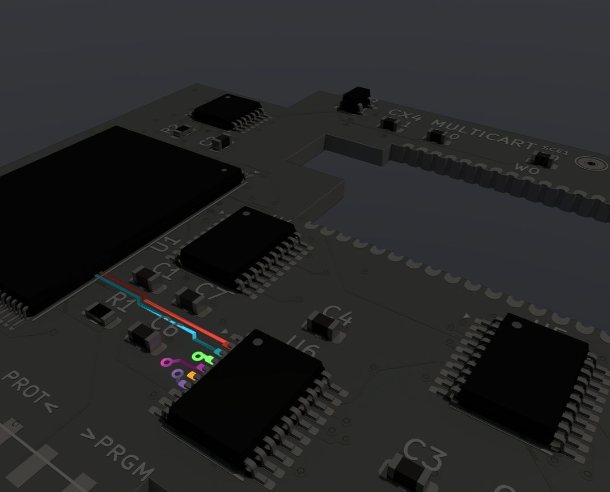 | 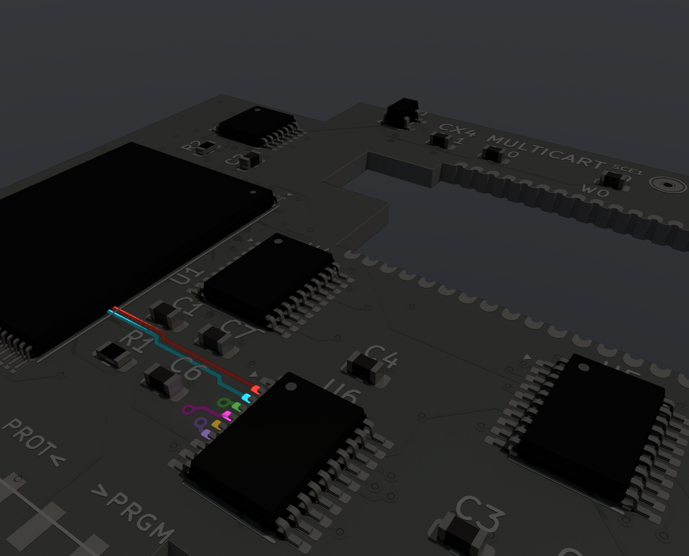 |
|---|---|
| Six nets, six colours — ray traced | The same, path traced and denoised |

### No netlist? Derive one from the copper

If a package has no net data at all — most Gerbers plotted without X2 — the
**Nets** panel offers *Infer nets from copper*. A net is physically just
galvanically-connected copper, so connectivity can be recovered exactly from
geometry: connected islands per layer, joined through plated barrels and
blind/buried vias. You get highlighting, colours and the animation on a board
that shipped with nothing but Gerbers.

They are labelled `~1`, `~2`… and the panel says plainly that they are derived.
Being clear about what this is **not**:

- **There are no names.** Ground comes back as `~1`, never `GND`.
- **An unrouted net appears as several** — the copper honestly reporting that
  it is not connected.
- **Two shorted nets appear as one.** With no netlist to check against, that is
  the most useful thing here.
- **Anything joined only through a component** — 0 Ω links, ferrites, net-ties
  — stays separate, because a component is not copper.

Since derived nets have no routed length to report (Gerber copper is filled
regions, not routes), the panel shows copper **area** instead, largest first —
so the pours and power planes sort to the top.

Highlighted nets also **animate**: a bright head sweeps from one end of the run
to the other, so you can see which way the signal goes and where it terminates,
then a band cycles along it so it stays easy to follow. This works in the path
tracer too, which is less obvious than it sounds — pcbview's path tracer
converges a still scene and resets on any change, so the animation is applied
when the finished image is resolved rather than while tracing. The image stays
fully converged while the net moves. Turn it off under **View → Animate net
highlight**.

## Controls

| Action | Control |
|---|---|
| Orbit / pan / zoom | Left-drag / middle-drag / scroll |
| Turn the board itself | `Shift` + drag (see object mode below) |
| Slide the board through space | `Shift` + middle-drag (`F` re-centres) |
| Globe-spin + twist | Right-drag (horizontal tumbles about the screen-vertical axis; vertical twists cw/ccw) |
| Exploded view | `Ctrl` + scroll |
| Top / Bottom / Isometric | `T` / `B` / `I` |
| Fit to board | `F` |
| Recentre board and view | `Home` (board square-on at the origin, view framed) |
| Orthographic toggle | `O` |
| Measure distance | `M` (click two points; `Esc` clears) |
| Open board / gerbers | `Ctrl`+`O` |
| Reload | `F5` |
| Save screenshot | `Ctrl`+`S` |
| Print (as shown) | `Ctrl`+`P` |
| Hide both side panels | `\` |

### View mode and object mode

The sun is fixed in the world, and the two modes differ in what actually moves
under it — which is visible, not just conceptual:

- **View mode** (default) moves the **camera** around a stationary board. The
  board's shading stays put and the sky sweeps past: you are walking around a
  lit object.
- **Object mode** (`Shift` with the mouse, `R3` on a controller) turns the
  **board** while the camera holds still. The sky does not move and light
  sweeps across the board as it turns: you are handling the object. Only in
  this mode can the board be slid through space, and `F` brings it back.

The gesture is identical in both; only the mechanism changes. The showcase has a
**Move board** checkbox that plays the very same playlist either way — checked,
the board turns and light travels across it, which is usually the better look
for a recorded video.

### Controller

A DualSense or Xbox pad is picked up automatically when connected, and hot-plug
works mid-session. Buttons are read by POSITION, so one mapping serves both:
south/east/west/north is cross/circle/square/triangle on a DualSense and A/B/X/Y
on an Xbox pad. The pad only steers while pcbview is the active application.

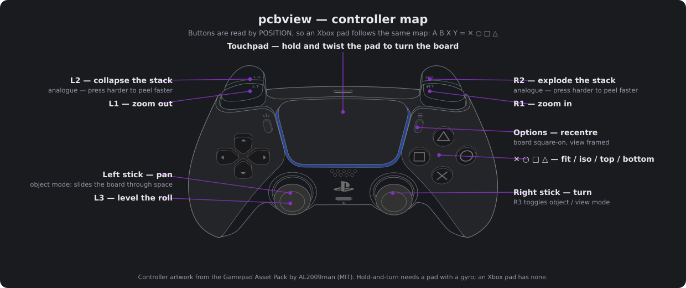

| Action | Control |
|---|---|
| Turn the board | Right stick |
| Pan | Left stick |
| Shrink / grow the board | `L1` / `R1` |
| Push further / bring nearer | `L2` / `R2` (analog — a light pull nudges, a full pull travels) |
| Collapse / explode | Hold `✕` and pull `L2` / `R2` (analog — press harder to peel faster) |
| Quarter-turns of the board | D-pad — up/down tumble it, left/right spin it in its own plane |
| Fit / Iso / Top / Bottom | Hold `□` and press D-pad right / left / up / down |
| Level the roll | `L3` |
| Object / view mode | `R3` |
| Recentre board and view | `Options` / `Start` |
| Hold and turn | Hold the DualSense touchpad and move the pad — 1:1, so a 30° motion turns the board 30° |

The size and distance pairs mean the same thing on a monitor and in the headset,
so there is one set of controls to learn. They differ in what they do underneath:
in VR the shoulders grow the board in the room and the triggers move it through
it, which are genuinely different tools — a bigger board is how you read fine
silkscreen without leaning into it. On a monitor there is no room to sit in, so
both fall back to the camera and stay distinct only in feel: the shoulders step
at a fixed rate, the triggers are pressure-proportional.

Explode is a **chord** rather than a bare trigger. It used to be `L2` / `R2`
alone, until a zoom control briefly shared those triggers and every attempt to
zoom quietly peeled the stack apart — reported, in good faith, as the silkscreen
floating above the board and the mask turning transparent. Holding `✕` costs
nothing once the thumb is resting there anyway, and makes taking the board apart
deliberate. That also freed the face buttons: `□` raises a labelled view menu
that says on screen what each D-pad direction does, and `○` and `△` are unused.

Hold-and-turn maps the pad's three motions to the three useful board motions:
nose up/down pitches it, twisting it like a steering wheel turns it left and
right, and turning it flat flips it left/right to the other side. View roll is
deliberately not driven — it only tips the horizon and is disorienting to steer
by hand.

Hold-and-turn calibrates out the gyro's zero-rate offset while the touchpad is
not held, so the board stays still until the pad actually moves — a DualSense at
rest reads about 0.011 rad/s, which would otherwise rotate the board some 38° a
minute on its own. It needs a pad with a gyro; an Xbox pad has none. Set
`PCBVIEW_PAD_DEBUG=1` to dump live stick, trigger and gyro values if a control
misbehaves.

Controller artwork in the map above is from the
[Gamepad Asset Pack](https://github.com/AL2009man/Gamepad-Asset-Pack) by
AL2009man, MIT licensed — see `docs/assets/LICENSE-gamepad-asset-pack.txt`.

Layer visibility, appearance (thickness / substrate / mask), and the print modes
live in the menus. Each side panel has a **pin** and a **hide** button — hide tucks
it to a spine on the edge that pops open on hover; pin keeps it open.

## VR

pcbview renders to an OpenXR headset. **VR mode** on the menu bar (`Alt`+`M`)
takes you in and out. Developed against a PSVR2 over SteamVR; any OpenXR runtime
should work, though nothing else has been tried.

Toggling rebuilds the viewport. That is not laziness — OpenXR *wraps* Vulkan
instance and device creation, injecting its own extensions and naming the
physical device, so the runtime has to be up before either exists. It reuses the
same teardown the CPU↔GPU device switch already needs, and the board, camera and
explode state all carry across. The check follows the live session rather than
the request, so if SteamVR is closed or no headset answers, the menu item does
not stay ticked.

The board is placed about **three times life size** at arm's length, anchored
where your head was. That is deliberate: readability depends on angular size, and
a 191 mm board shown 0.35 m across renders 1 mm of silkscreen at roughly five
pixels — readable either at 0.13 m, where the eyes have to cross and the board
swallows the view, or at three times the size at a comfortable distance. The
second costs no more, because fill is bounded by the screen rather than by the
board.

The desktop window mirrors the left eye while a session runs.

### What it does

- Stereo at the runtime's own per-eye resolution, using the asymmetric per-eye
  frusta the headset actually reports.
- A submitted depth layer (`XR_KHR_composition_layer_depth`), so a dropped frame
  is reprojected by geometry. Without it the runtime can only warp rigidly, and a
  rigid warp cannot reproduce parallax — at 0.4 m that reads as parts of the
  image sliding against each other.
- The hidden-area mesh (`XR_KHR_visibility_mask`), so corners the lenses never
  show are not shaded.
- Fixed foveation via `VK_KHR_fragment_shading_rate`.
- A quality ladder that trades ray count, shading rate and render resolution
  against a measured cost model to hold 90 Hz, rather than against hard-coded
  distance thresholds.
- Sense controller grips — reach out and take hold of the board.

**Use ray-traced raster in the headset.** Path tracing works but is slow enough
that SteamVR dislikes it, and it is not the mode to explore a board in.

### Tuning

Everything below is an environment variable, and all of it is optional — the
defaults are what the headset was tuned with.

| Variable | Effect |
|---|---|
| `PCBVIEW_VR_RT=0` | Ray-traced shading off. The cheapest large win if frames are late |
| `PCBVIEW_VR_RAYQ=0..2` | Pin the ray count instead of letting the ladder choose |
| `PCBVIEW_VR_FOVEATE=0..2` | Pin the foveation level |
| `PCBVIEW_VR_RES=0.25..1.0` | Render scale against the runtime's recommendation. Default `0.5`, which still lands above the panel's own resolution — SteamVR's extra supersampling is not affordable alongside rays, and the rays are worth more |
| `PCBVIEW_VR_ADAPT=0` | Turn the quality ladder off entirely (`=ladder` reverts to the old distance thresholds) |
| `PCBVIEW_VR_SIZE=x3` | Board size at placement. `x3` is three times life size; a plain number is an absolute width in metres. Default `x3` |
| `PCBVIEW_VR_DIST=<m>` | How far away it is anchored |
| `PCBVIEW_VR_HUD_M=<m>` | Pin the zoom readout to a fixed distance instead of the board's |
| `PCBVIEW_VR_DUMP_EYES=<prefix>` | Write both eye images to disk the first time the readout appears |
| `PCBVIEW_VR_PT=1` | Path trace in the headset |
| `PCBVIEW_VR_DEPTH=0` | Stop submitting the depth layer |

### Known limitations

- The quality ladder can change render resolution several times in quick
  succession as the board moves through the view. Each change rebuilds the
  per-eye targets and costs a few milliseconds, so it shows up as an occasional
  hitch.
- No OpenXR action manifest ships yet, so bindings are not rebindable from
  SteamVR's own UI.
- Eye-tracked foveation is not reachable: PSVR2 over PC does not expose eye gaze
  to OpenXR, and the runtime offers no foveation extension of its own. The
  foveation here is fixed, not gaze-driven.

## Installing

Grab the latest release from the
[Releases page](https://github.com/djanice1980/pcbview/releases):

- **`pcbview-<version>-setup.exe`** — Windows installer: Start Menu entry,
  optional desktop shortcut, uninstaller. Installs per-machine (admin) or
  per-user — the installer asks.
- **`pcbview-<version>-win64.zip`** — portable: unzip anywhere and run
  `pcbview.exe`. No installation, nothing written outside its folder (settings
  go to `~/.pcbview/settings.xml`).

Both are self-contained — Qt, the CPU Vulkan driver, Embree, and the denoiser
are all bundled. No prerequisites.


### Unattended / scripted install

The installer is [Inno Setup](https://jrsoftware.org/isinfo.php), so it takes
the standard switches. Every command below is exercised on each release —
install, upgrade-over-running and uninstall are how the packages get verified
before they are published.

```bat
:: per-machine (needs an elevated context: SYSTEM, an RMM agent, or admin)
pcbview-1.17.1-setup.exe /VERYSILENT /SUPPRESSMSGBOXES /NORESTART /ALLUSERS

:: per-user, no elevation, custom location
pcbview-1.17.1-setup.exe /VERYSILENT /SUPPRESSMSGBOXES /NORESTART /CURRENTUSER /DIR="%LOCALAPPDATA%\pcbview"

:: also drop a desktop shortcut (off by default)
pcbview-1.17.1-setup.exe /VERYSILENT /SUPPRESSMSGBOXES /NORESTART /TASKS="desktopicon"

:: write an install log for diagnosis
pcbview-1.17.1-setup.exe /VERYSILENT /LOG="%TEMP%\pcbview-install.log"
```

**Upgrading needs neither the old version removed nor pcbview closed.** The
installer uses Restart Manager to shut a running instance down, replaces it and
returns exit code 0, rather than failing on a locked file or leaving a
half-updated install behind.

**Detection and removal.** The usual values are published under
`...\CurrentVersion\Uninstall\` (HKLM for a per-machine install, HKCU for
per-user):

| value | use |
|---|---|
| `DisplayName` | `pcbview` (a per-user install appends ` (Current user)`) — no version in it, so it is stable across releases and safe to match on |
| `DisplayVersion` | the version, e.g. `1.17.0` |
| `InstallLocation` | install directory |
| `QuietUninstallString` | ready-made silent uninstall command |

```bat
:: silent uninstall
"C:\Program Files\pcbview\unins000.exe" /VERYSILENT /SUPPRESSMSGBOXES /NORESTART
```

Check the exit code rather than assuming success: 0 is success, and a silent
installer that hits an elevation prompt returns **2** having installed nothing.

For an install-free rollout, ship the portable zip instead — it writes nothing
outside its own folder except `~/.pcbview/settings.xml`.

## Building from source

pcbview builds on **Windows (MSVC)** and **Linux**.

### Linux

On Arch/CachyOS the packaged route does everything — dependencies, the
binary, a launcher entry with icon — and offers the optional pieces
(KiCad + its 3D model library for component bodies, `vulkan-swrast` for
CPU rendering, `ffmpeg` for video recording) as choices at install time:

```sh
cd packaging/linux && makepkg -si
```

Or build directly — Qt6, SDL3, OpenXR, Embree and Open Image Denoise come
from system packages rather than being fetched:

```sh
sudo pacman -S --needed base-devel cmake ninja vulkan-headers shaderc \
    qt6-base sdl3 openxr embree openimagedenoise
cmake -B build -G Ninja -DCMAKE_BUILD_TYPE=Release
cmake --build build
./build/pcbview
```

VR is Windows-only (`PCBVIEW_ENABLE_VR` defaults OFF on Linux — a PSVR2
has no Linux path today); everything else, including the path tracer,
the denoiser, CPU rendering and video recording (via the system
`ffmpeg`), works identically.

### Windows

You need:

1. **Vulkan SDK 1.4+** — <https://vulkan.lunarg.com/> (sets the `VULKAN_SDK`
   environment variable; provides `glslc`, used at build time to compile shaders).
2. **Qt 6.5+ (MSVC 64-bit kit)** — installed via the Qt online installer. Point the
   build at it with `-DQT_ROOT=C:/Qt/6.11.1/msvc2022_64` (or set `QT_ROOT`). The kit
   **must** be built with the same compiler as this project — a MinGW Qt kit will
   not link against MSVC.
3. **Visual Studio 2022+** with the C++ workload — it bundles CMake and Ninja, so no
   separate CMake install is required. (Any CMake ≥ 3.24 works if you have one.)

Everything else — Clipper2, earcut, glm, miniz, cgltf — is fetched automatically by
CMake; there is nothing else to install.

```sh
# from the repo root
cmake -B build -DQT_ROOT=C:/Qt/6.11.1/msvc2022_64
cmake --build build --config Release --target pcbview

# stage the Qt DLLs beside the exe for a portable, double-clickable folder
cmake --build build --config Release --target deploy
```

The result is `build/Release/pcbview.exe`. Run it with no arguments for the empty
viewer, or `pcbview.exe path/to/board.kicad_pcb`. The **`deploy`** target runs
`windeployqt` so the `build/Release` folder is xcopy-portable.

> **3D components** are optional and require KiCad to be installed (pcbview shells
> out to `kicad-cli` once per board and caches the result). Everything else works
> without KiCad. Set `PCBVIEW_KICAD_CLI` to point at a specific `kicad-cli.exe`, or
> `PCBVIEW_NO_COMPONENTS` to skip components entirely.

## How it works

The pipeline is `KiCad → BoardModel → LayerArt → BoardMesh → renderer` and
`Gerber → LayerArt → BoardMesh → renderer`. **LayerArt** — filled polygons per
layer — is the meeting point: only the importers know what a "track" is; everything
downstream is format-agnostic. Booleans are done in integer coordinates with
Clipper2, triangulated with earcut, and drawn through a reversed-Z Vulkan
rasterizer with a bindless per-instance material table.

The full design record — every measured fact, coordinate convention, and bug
post-mortem — lives in [ARCHITECTURE.md](ARCHITECTURE.md).

## Licensing

pcbview is licensed under the **GNU General Public License v3.0** — see
[LICENSE](LICENSE). It embeds KiCad's **Newstroke** stroke font (GPL-2.0-or-later)
for silkscreen text, and links Qt 6 (LGPL-3.0, dynamically) and the Vulkan loader
(Apache-2.0). GPL **v3** specifically is required because LGPL-3.0 and Apache-2.0
are incompatible with GPL-2.0. Full third-party attributions are in
[NOTICE.md](NOTICE.md), with license texts under [LICENSES/](LICENSES/).

## Roadmap

- **Done:** KiCad + Gerber import, tessellation, soldermask & silkscreen, the Qt
  "pro-CAD" GUI, exploded view, board appearance, 3D components, print/export,
  ray-query ray tracing (contact shadows + AO) with GPU selection, full
  path tracing (translucent mask, exploded view, visibility toggles) with
  GPU-accelerated Intel OIDN denoising on a background thread, via barrels with
  per-tool Excellon plating, mounting-hole / slot cutouts from Edge_Cuts, a
  full CPU rendering device (Mesa lavapipe raster + Embree ray tracing), soft
  sun shadows + diffuse laminate transmission, a Windows installer,
  blind/buried via spans, Excellon rout-mode slots, measurement tools with
  snapping + net path lengths + board-dimension callouts, and
  high-resolution (up to 4×) screenshot export.
- **Next:** a Linux build, a showcase mode
  that choreographs the camera and records short video clips, party mode
  (spinning coloured lights; disco ball under consideration), and user
  shader plugins — assign a custom shader to part of the stack, for hairy
  soldermask or liquid-metal traces.
- **Known gaps**, tracked in
  [ARCHITECTURE.md](ARCHITECTURE.md): the KiCad path derives the stackup
  rather than reading an explicit `(setup (stackup ...))` block (gerbers read
  real thicknesses, so they are currently more accurate for an asymmetric
  stack); oval drills are approximated as round; custom/trapezoid pads fall
  back to their bounding rect; and exposed copper is rendered bare rather
  than ENIG/HASL. Each is warned about rather than silently wrong.

## Author & support

Built by **David Janice** — [github.com/djanice1980](https://github.com/djanice1980).

For questions, bug reports, or feature requests, please
[open an issue](https://github.com/djanice1980/pcbview/issues) on this repository.

If pcbview is useful to you, you can support its development:

[](https://ko-fi.com/P5P81EV1M0)

(In the app: **Help → Support on Ko-fi**.)

*Developed with the assistance of [Claude Code](https://claude.com/claude-code).*
